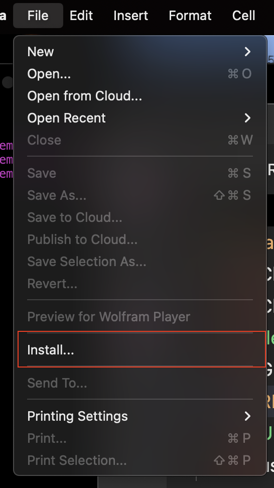
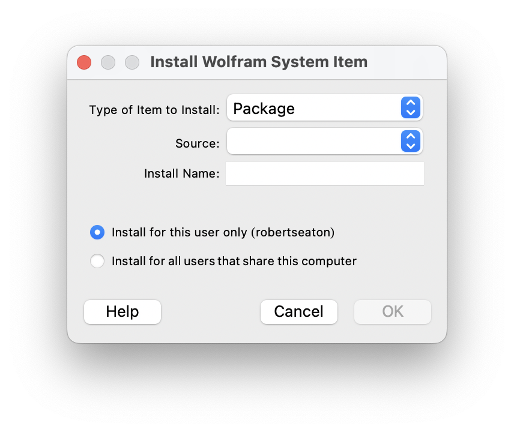
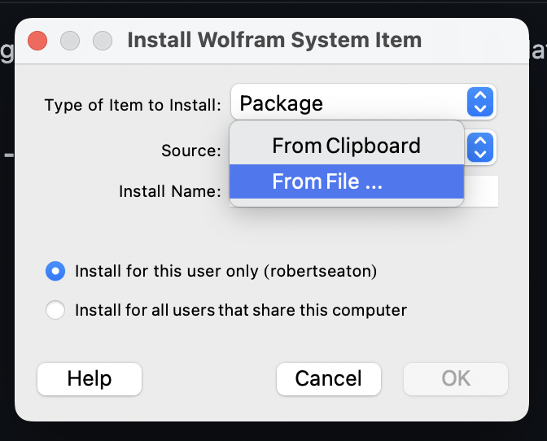
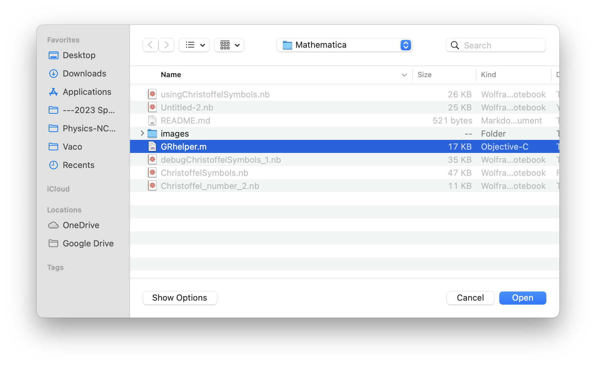

# Installing the GRHelper package

Until I can find a more permanent solution, you're going to have to do this every time you start up Mathematica AND want to use functionality from this package.

Inside the Mathematica desktop application, select  **File -> Install...**

which will bring up a dialog to select the package source.

Click on the "Source" dropdown and select "From File..."

That will bring up the filesystem dialog. Navigate to where you downloaded the GRHelper.m file.

Finally, select "OK" in this redundantly redundant dialog.

## Load
