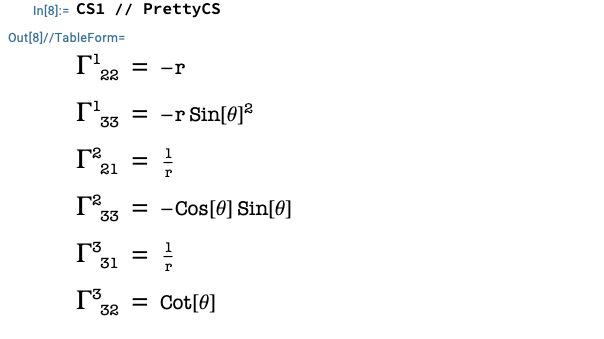
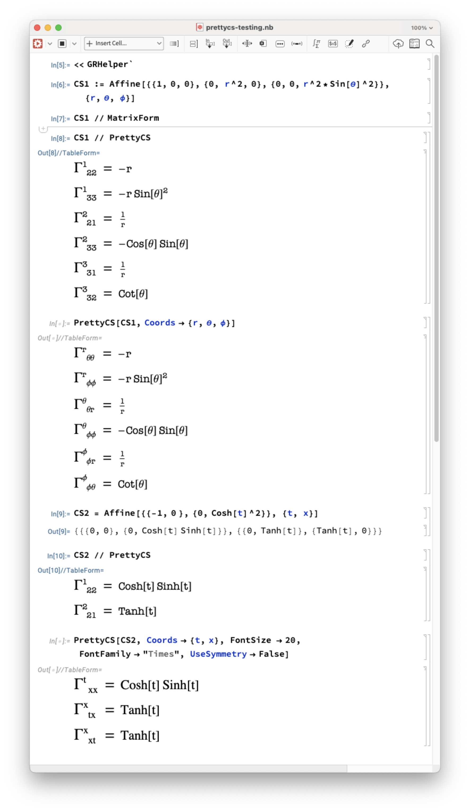
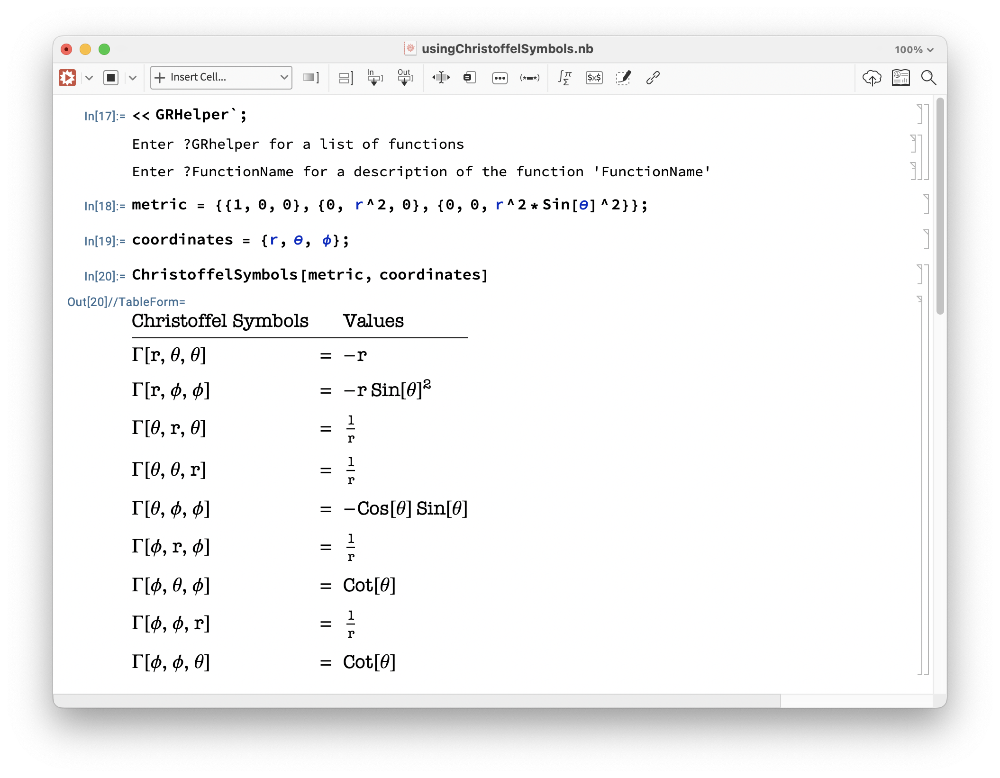
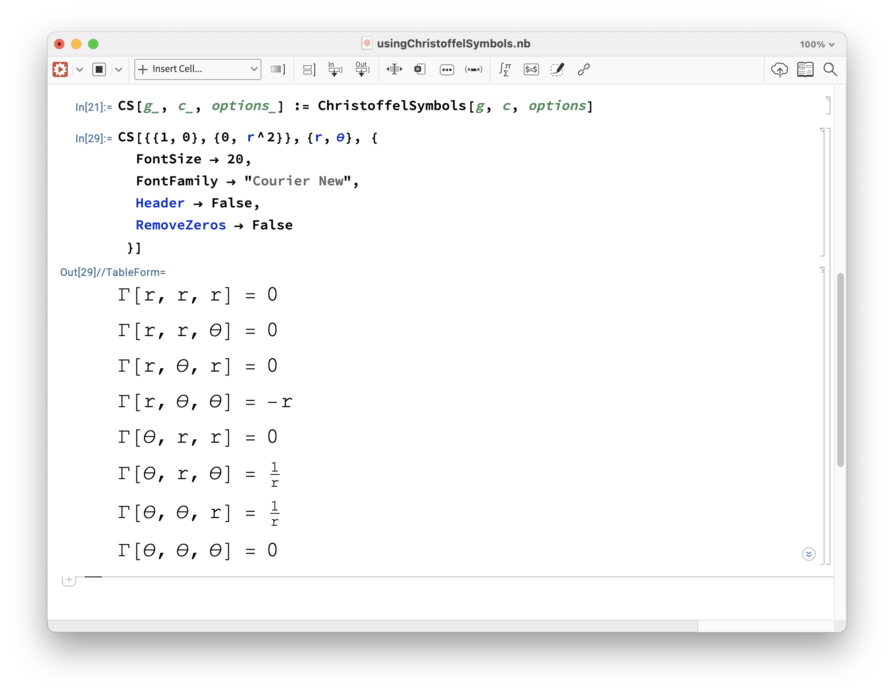

# GRHelper.m

The functions within the [GRHelper.m](./GRHelper.m) Mathematica package were originally written by Chuck Evans (and some of his grad students) @ UNC Chapel Hill.

David Brown @ NC State created the GRHelper package and tidied things up and put those functions into the package form you see here.

Bob Seaton @ NC State wanted a prettier output for the Christoffel Symbols, so he added that function and checked it into github. Apparently, he also likes talking about himself in the 3rd person :P 
## Usage

Inside the Mathematica Desktop app, locate and open the **usingChristoffelSymbols.nb** file (open it inside Mathematica!). It has examples you can play with. But before you can use that file, you'll need to [install the GRHelper package](README-InstallPackage.md).

To use any function in the GRHelper package, do like you were instructed above and **Install the package first**! Once that's done, then you can use any of the functions in the package.

### PrettyCS
Takes a list (result from an Affine operation) and displays that list in a "pretty" format.

<b>ARGS</b>
With no args, PrettyCS will do its best to determine the dimensionality of the input list. The coordinate indices are numeric, like this:

    

<b>ARGS</b>
<table>
    <thead>
        <tr>
            <th>Option</th>
            <th>Default</th>
            <th>Usage</th>
            <th>Description</th>
        </tr>
    </thead>
    <tbody>
        <tr>
            <td>FontSize</td>
            <td>16</td>
            <td>FontSize -> 22</td>
            <td>Set the font size (measured in points) of the output</td>
        </tr>
        <tr>
            <td>FontFamily</td>
            <td>"American Typewriter</td>
            <td>FontFamily -> "Courier"</td>
            <td>Set the font family of the output. You can choose from whatever font family your machine supports.</td>
        </tr>
        <tr>
            <td>UseSymmetry</td>
            <td>True</td>
            <td>UseSymmetry -> False}</td>
            <td>The asusumption is that the 2nd and 3rd indices are symmetric, with &Gamma;^{&alpha;}_{&mu;&nu;} = &Gamma;^{&alpha;}_{&nu;&mu;}.  If set "False", all Christoffel Symbols will be show (redundant output)</td>
        </tr>
        <tr>
            <td>Coords</td>
            <td>{"1","2","3"}</td>
            <td>Coords -> {r, &theta;, &phi;}</td>
            <td>Sets the coordinates to display the indices in.</td>
        </tr>
    </tbody>
</table>

Output from [prettycs-testing.nb](prettycs-testing.nb)

    

### Function: ChristoffelSymbols

First, bring all of the GRHelper references into the current $Context with the "<< GRHelper`" command.
### Default settings

To use the ChristoffelSymbols function, you'll need to define a metric and a set of coordinates.  The image below shows what the results from default settings look like.

The next image shows how all of the options can be used. It is also possible to define a new variable to represent the "ChristoffelSymbol" function name -- Mathematica doesn't care and neither do I :) .

## ChristoffelSymbols Options

<table>
    <thead>
        <tr>
            <th>Option</th>
            <th>Default</th>
            <th>Usage</th>
            <th>Description</th>
        </tr>
    </thead>
    <tbody>
        <tr>
            <td>FontSize</td>
            <td>16</td>
            <td>FontSize -> 22</td>
            <td>Set the font size (measured in points) of the output</td>
        </tr>
        <tr>
            <td>FontFamily</td>
            <td>"American Typewriter</td>
            <td>FontFamily -> "Courier"</td>
            <td>Set the font family of the output. You can choose from whatever font family your machine supports.</td>
        </tr>
        <tr>
            <td>Header</td>
            <td>True</td>
            <td>Header -> False}</td>
            <td>If set "False", the header won't be displayed</td>
        </tr>
        <tr>
            <td>RemoveZeros</td>
            <td>True</td>
            <td>RemoveZeros -> False</td>
            <td>If set to "True", any symbol that evaluates to zero will be removed. If false, all permutations of Christoffel Symbols will be shown</td>
        </tr>
    </tbody>
</table>
