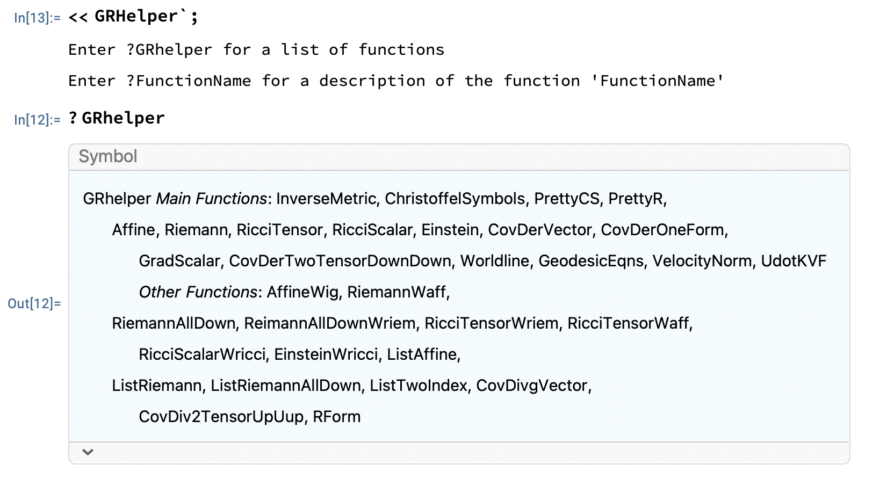
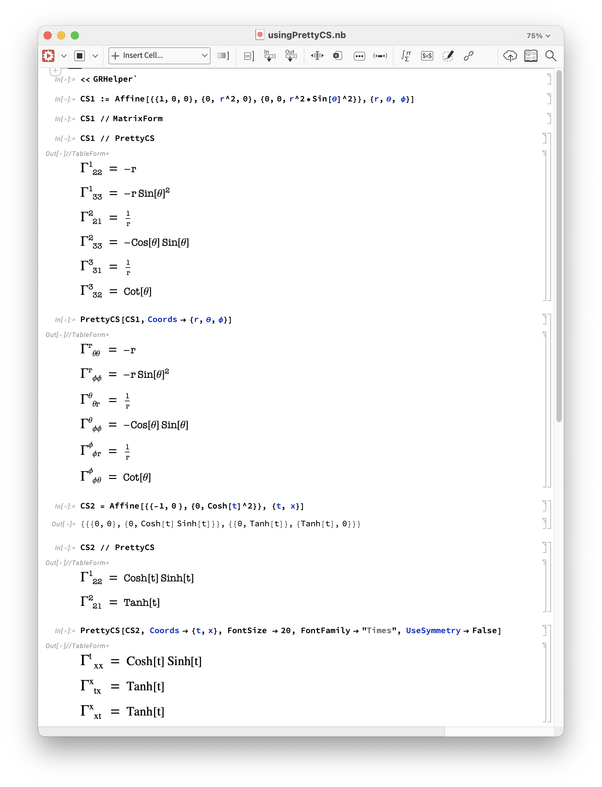
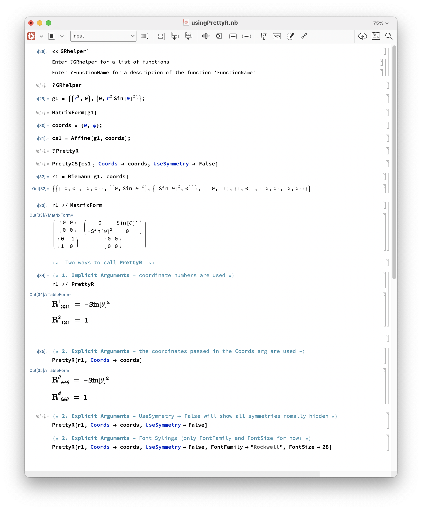
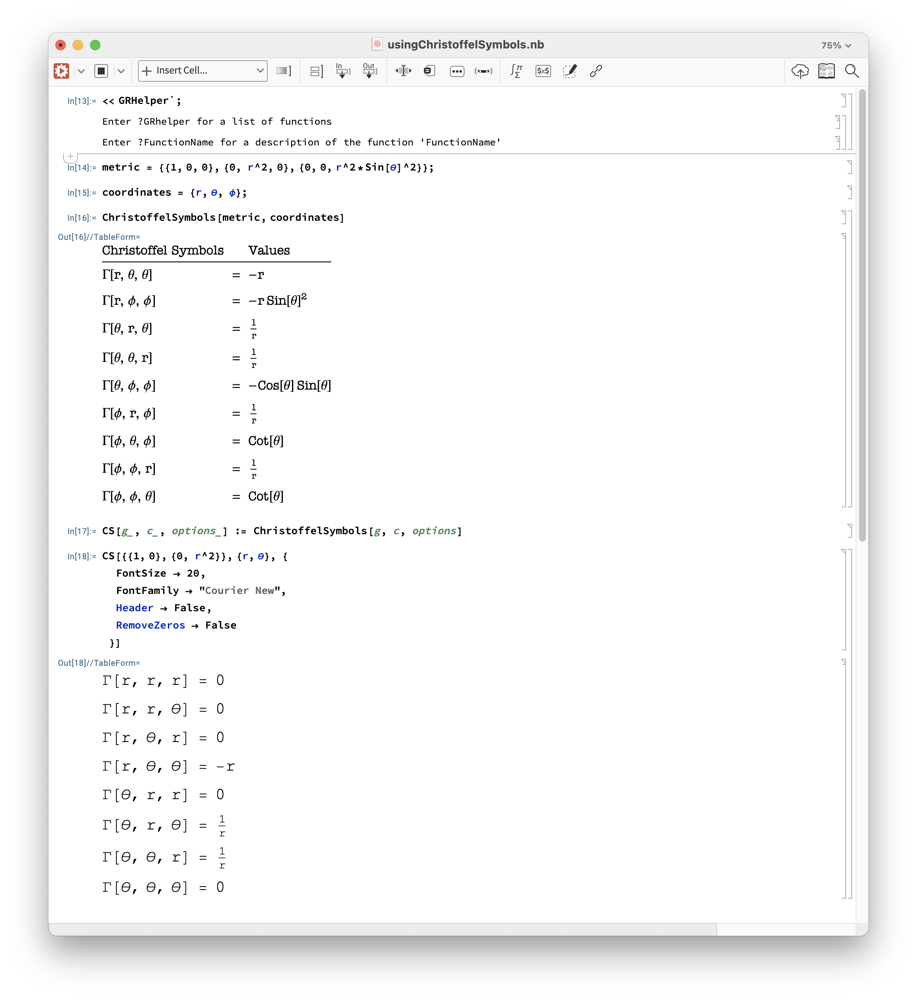

# GRHelper.m

The functions within the [GRHelper.m](./GRHelper.m) Mathematica package were originally written by **Chuck Evans** (and some of his grad students) @ UNC Chapel Hill.

**David Brown** @ NC State created the GRHelper package and tidied things up and put those functions into the package form you see here.

Bob Seaton @ NC State wanted a prettier output for the Christoffel Symbols and Riemann Tensors, so he added that functionality and checked it into github. *Apparently, he also likes talking about himself in the 3rd person* :P 

## Installation

First things first, you need to [install the GRHelper package](README-InstallPackage.md) if you haven't already.

## Usage

Once GRHelper is installed, within Mathematica, locate and open the **usingChristoffelSymbols.nb** file - it has some examples you can play with.

GRHelper has a large collection of functions GR functions. To see the list, after installation, just run ```?GRhelper``` within Mathematica:

<p align="center">
    
</p>

This README will just focus on the functions ```ChristoffelSymbols```, ```PrettyCS```, and ```PrettyR```.

### Function: PrettyCS

Takes a list (result from an ```Affine``` operation) and displays that list in a "pretty" format. Here's what it looks like in action:

<p align="center">
    
</p>

The above examples (with and without args) are contained in the [usingPrettyCS.nb](usingPrettyCS.nb) Mathematica notebook.

#### PrettyCS options

* ```FontSize```
  * Description: Sets the font size (measured in points) of the output
  * Default: 16
  * Usage: ```FontSize -> 22```
* ```FontFamily```
  * Description: Sets the font family of the output. You can choose from whatever font family your machine supports.
  * Default: American Typewriter
  * Usage: ```FontFamily -> "Courier"```
* ```UseSymmetry```
  * Description: The assumption is that the 2nd and 3rd indices are symmetric, with &Gamma;^{&alpha;}\_{&mu;&nu;} = &Gamma;^{&alpha;}\_{&nu;&mu;}.  If set "False", all Christoffel Symbols will be show (redundant output)
  * Default: True
  * Usage: ```Header -> False```
* ```Coords```
  * Description: Sets the coordinates to display the indices in
  * Default: {"1","2","3"}
  * Usage: ```Coords -> {```r```, ```&theta;```, ```&phi;```}```

### Function: PrettyR

Takes the output from the ```Riemann``` function and puts the indices in their place. The options avalailable for ```PrettyR``` are the same as those for ```PrettyCS```.

<p align="center">
    
</p>

See the ```usingPrettyR.nb``` mathematica notebook for examples and variations on options available.

### Function: ChristoffelSymbols

This was the initial version of what became PrettyCS. Here's what the setup and output looks like:

<p align="center">
    
</p>

See the ```usingChristoffelSymbols.nb``` mathematica notebook for examples and variations on options available.


## ChristoffelSymbols Options

* ```FontSize``` - Sets the font size (measured in points) of the output
  * Default: 16
  * Usage: ```FontSize -> 22```
* ```FontFamily``` - Sets the font family of the output. You can choose from whatever font family your machine supports.
  * Default: American Typewriter
  * Usage: ```FontFamily -> "Courier"```
* ```Header``` - If set "False", the header won't be displayed
  * Default: True
  * Usage: ```Header -> False```
* ```RemoveZeros``` - If True, any symbol that evaluates to zero will be removed
  * Default: True
  * Usage: ```RemoveZeros -> False```
  