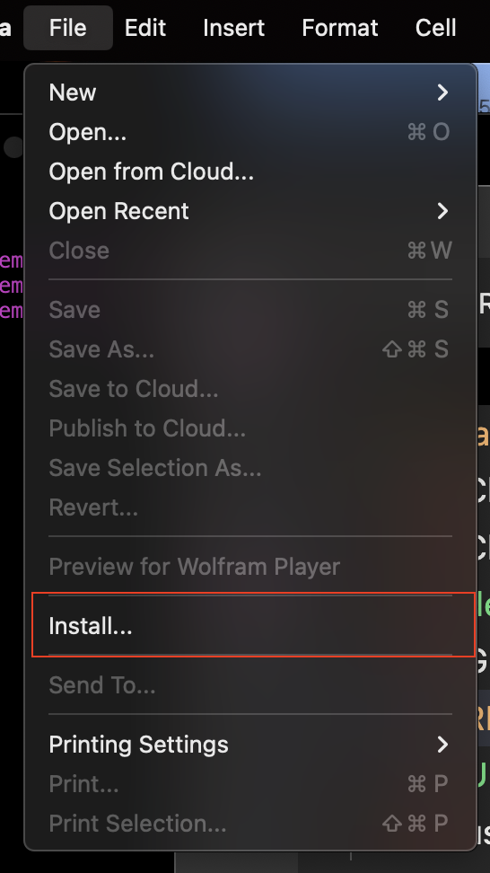

# GRHelper Usage

Probably the easiest thing to tell you is to open up the usingChristoffelSymbols.nb. It'll show you some usage examples. But since you're here, I'll try to get you up to speed.

## Install GRHelper package into Mathmatica

Until I can find a more permanent solution, you're going to have to do this every time you start up Mathematica AND you want to use this package.

Inside the Mathmatica desktop application, select  **File -> Install...**

## Load 